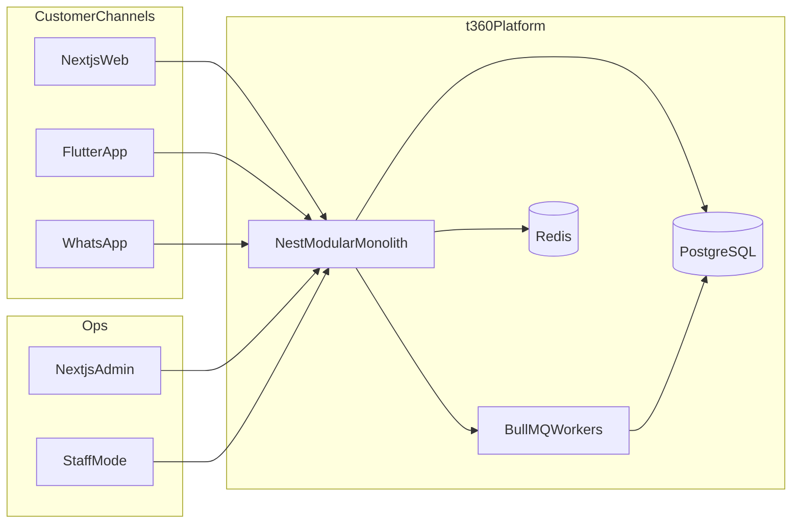

# System Architecture — Tharagai Digital (t360)

## Pattern

**Modular monolith** on NestJS. Modules are independently testable and bounded so they can later be extracted into services if required. Do not start with microservices.

## High-level diagram

## Technology stack

| Layer | Choice |
|-------|--------|
| Customer web | Next.js, TypeScript, React, Tailwind, shadcn/ui, TanStack Query, RHF, Zod |
| Admin / staff | Same as web; feature-based folders; responsive |
| Mobile | Flutter, Riverpod, GoRouter, Dio, Freezed/json_serializable; clean architecture |
| API | Node.js, NestJS, TypeScript |
| ORM / DB | Prisma, PostgreSQL (UUIDs, FKs, indexes, migrations, soft delete, audit) |
| Cache / queues | Redis, BullMQ (never source of truth for business data) |
| Media | Cloudinary via `MediaStorage` port (S3-compatible later) |
| Payments | Razorpay via `PaymentProvider` port |
| Push | Firebase Cloud Messaging |
| Email | Resend via email port (SES later) |
| SMS / OTP | India provider via SMS port |
| WhatsApp | Official WhatsApp Business Platform API |
| AI | OpenAI via `AiProvider` + tool registry |
| Search Phase 1 | PostgreSQL FTS + `pg_trgm` |
| Analytics | GA4; optional PostHog |
| Errors | Sentry (web, admin, API, Flutter) |
| Monorepo | pnpm + Turborepo |
| CI | GitHub Actions |
| Local | Docker Compose (API, Postgres, Redis, worker) |

## NestJS module map (logical)

`AuthModule`, `UsersModule`, `CustomersModule`, `EmployeesModule`, `RbacModule`, `BranchesModule`, `CatalogModule` (products/categories/brands), `InventoryModule`, `CartModule`, `WishlistModule`, `OrdersModule`, `PaymentsModule`, `ShipmentsModule`, `CouponsModule`, `OffersModule`, `LoyaltyModule`, `ReviewsModule`, `NotificationsModule`, `WhatsappModule`, `SocialModule`, `AiModule`, `AnalyticsModule`, `ReportsModule`, `IntegrationsModule`, `SettingsModule`, `AuditModule`, `SupportModule`, `CmsModule`, `HealthModule`.

Cross-cutting: logging, request IDs, exception filters, idempotency middleware, rate limiting.

## Client architecture notes

- **Web:** modern Next.js; SSR/RSC where beneficial for SEO and PDP performance.
- **Admin:** feature folders (`features/dashboard`, `products`, `inventory`, …); no giant pages.
- **Flutter:** `features/*` with presentation / domain / data layers; repositories; DI; secure storage for tokens.
- **i18n:** English + Tamil; no hardcoded user-facing strings in components.

## Design system (Phase 2)

Premium fashion-retail brand for Tharagai Readymades — not generic SaaS clothing. Shared web components in `packages/ui`; Flutter mirrors with `Tharagai*` widgets. Details deferred to Phase 2 after gate approval.

## Multi-tenancy stance

Single-tenant Tharagai for v1. Nullable `tenantId` may be reserved on root business entities for future SaaS. No tenant isolation runtime, billing, or provisioning in current phases.

## AWS-ready mapping (future)

| Now | Later AWS |
|-----|-----------|
| Railway Postgres | RDS PostgreSQL |
| Railway Redis | ElastiCache |
| Cloudinary | S3 + CloudFront |
| Railway API/worker | ECS (+ SQS if queues move) |
| Env secrets | Secrets Manager |
| Logs/metrics | CloudWatch |

Do **not** introduce Kubernetes unless there is a demonstrated requirement.
