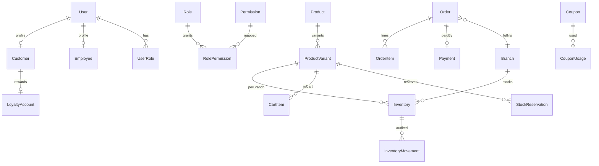

# Database Architecture — t360

## Principles

- PostgreSQL + Prisma
- UUID primary keys
- `createdAt` / `updatedAt` on all tables
- Foreign keys and unique constraints
- Indexes for SKU, barcode, slug, order number, mobile, email
- Soft delete (`deletedAt`) where appropriate (products, customers, etc.)
- Transactions for inventory and payments
- Optimistic concurrency (`version`) on `Inventory` where useful
- Audit trails for admin/stock mutations
- Idempotency keys for payments, orders, webhooks
- Nullable `tenantId` reserved on selected roots — unused in v1 queries

## Conceptual ERD



## Entity catalogue

### Identity & access

| Entity | Purpose |
|--------|---------|
| User | Auth identity (mobile/email), status, lockout fields |
| Session / Device | Refresh token rotation, device metadata |
| Role | Named role (Owner, Manager, …) |
| Permission | `resource.action` string |
| RolePermission | M:N role ↔ permission |
| UserRole | M:N user ↔ role |
| Customer | Shopper profile linked to User |
| Employee | Staff profile linked to User; optional home branch |

### Organisation

| Entity | Purpose |
|--------|---------|
| Branch | Store location, hours, status, contact |
| Warehouse | Optional stock location linked to branch |

### Catalogue

| Entity | Purpose |
|--------|---------|
| Category | Tree via parentId (category/subcategory) |
| Brand | Brand master |
| Product | Name, slug, description, status, brand, category |
| ProductVariant | SKU, barcode, price, cost, sale price, attributes |
| ProductImage | Media refs (Cloudinary public ids/URLs), sort order |
| ProductAttribute | Configurable attribute definitions/values |

### Inventory

| Entity | Purpose |
|--------|---------|
| Inventory | physicalQty, reservedQty, version, branchId, variantId |
| InventoryMovement | Immutable audit of qty changes |
| StockReservation | Hold for cart/order; expiry |
| StockTransfer | Branch-to-branch transfer header/lines |
| StockAdjustment | Explicit adjustment records (or via movement type) |

### Commerce

| Entity | Purpose |
|--------|---------|
| Cart / CartItem | Customer cart |
| Wishlist / WishlistItem | Wishlist |
| Address | Customer addresses |
| Order / OrderItem | Orders and lines |
| Payment | Provider refs, amount, status, idempotency |
| Refund | Refund attempts linked to payment/order |
| Shipment | Delivery tracking |
| IdempotencyKey | Generic idempotency store |
| WebhookEvent | Provider event dedupe |

### Marketing & CRM

| Entity | Purpose |
|--------|---------|
| Coupon / CouponUsage | Discounts and redemptions |
| Offer / Campaign | Campaign engine |
| LoyaltyAccount / LoyaltyTransaction | Tharagai Rewards |
| Review | Stars/text/images; verified flag; moderation |
| SocialPost | Draft social commerce content |
| Notification / NotificationTemplate | Outbound messages |
| SupportTicket (+ notes) | Customer service |

### AI & platform

| Entity | Purpose |
|--------|---------|
| AIConversation / AIMessage | Chat history |
| AuditLog | Who/what/when for sensitive actions |
| Integration | POS/other integration config |
| SystemSetting | Business configuration KV |
| CmsBlock / CmsPage | Homepage and content (name may vary) |

## Inventory formulas

```
available = physicalQty - reservedQty
```

Critical paths (reserve, commit, release, transfer, adjust) **must** run in a single database transaction and write movement rows.

## Search (Phase 1)

- `tsvector` / Prisma raw or generated columns for product search
- `pg_trgm` indexes for typo tolerance and partial match
- Synonyms table optional later; do not block MVP

## Seed data (development only)

Minimum when Phase 3–4 seeds land: ~30 products, 10 categories, 5 brands, variants, branches, customers, orders, coupons, reviews, inventory. Clearly labeled demo data; never used as production source of truth.

## Migrations

- All schema changes via Prisma migrate
- Migration tests in CI before staging/production apply
- Document backup/restore before production migrate ([../deployment/DEPLOYMENT.md](../deployment/DEPLOYMENT.md))
