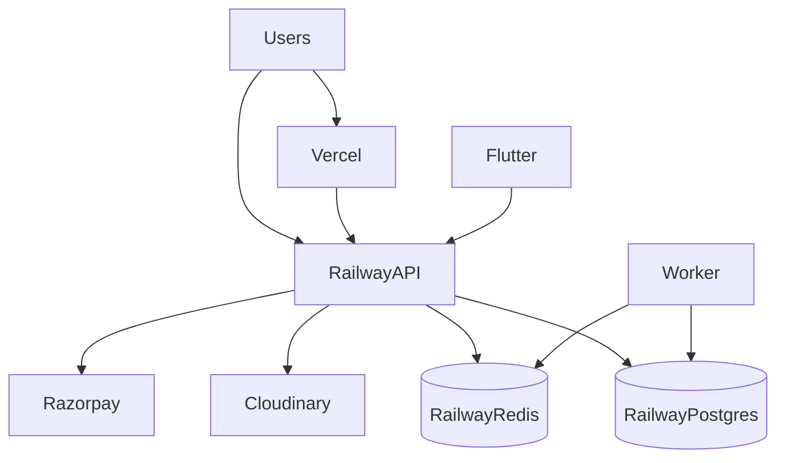

# Deployment Architecture — t360

## Environments

| Environment | Purpose |
|-------------|---------|
| development | Local docker-compose + `.env` |
| staging | Pre-prod; realistic integrations in test mode |
| production | Live Tharagai Digital |

Never mix production credentials into development. See [ENV.md](./ENV.md) and [RUNBOOK.md](./RUNBOOK.md).

## Hosting topology (locked)

| Component | Platform |
|-----------|----------|
| `apps/web` | Vercel (edge CDN) |
| `apps/admin` | Vercel (edge CDN) |
| `apps/api` | Railway project **`t360`** (Dockerfile) |
| `worker` (BullMQ) | Railway service in **`t360`** (same image, worker CMD) |
| PostgreSQL | Railway managed |
| Redis | Railway managed |
| Media | Cloudinary (CDN delivery) |
| Mobile | Play Store / App Store — see [STORE-LISTING.md](../launch/STORE-LISTING.md) |



## Local development

```bash
pnpm docker:up          # postgres + redis
# optional full stack:
docker compose --profile app up -d --build
pnpm prisma:migrate
pnpm prisma:seed
pnpm --filter @t360/web dev
pnpm --filter @t360/admin dev
```

- Default compose: Postgres + Redis only.
- Profile `app`: builds `apps/api/Dockerfile` for `api` (port 4000) and `worker`.

## Docker (API / worker)

| File | Role |
|------|------|
| [apps/api/Dockerfile](../../apps/api/Dockerfile) | Multi-stage Nest build |
| [.dockerignore](../../.dockerignore) | Exclude node_modules/.next |
| CMD default | `node dist/src/main.js` |
| Worker override | `node dist/src/worker.js` |

Railway: set Dockerfile path to `apps/api/Dockerfile`; create two services (api + worker) from the same image with different start commands. See `railway.toml` hints at repo root.

## CI/CD (GitHub Actions)

| Workflow | Role |
|----------|------|
| [`.github/workflows/ci.yml`](../../.github/workflows/ci.yml) | PR / push → install, typecheck, api tests, build api/web/admin |
| [`.github/workflows/deploy.yml`](../../.github/workflows/deploy.yml) | Secret-gated staging (main + dispatch) / production (dispatch + approval) |

```
PR / push main → pnpm install → prisma generate → typecheck → api tests → build api/web/admin
Deploy (when secrets set) → Vercel web+admin + Railway api+worker → smoke
```

Full operator setup: [STAGING.md](./STAGING.md). Production is never auto-deployed without `workflow_dispatch` + GitHub Environment approval.

## Staging vs production matrix

| Concern | Staging | Production |
|---------|---------|------------|
| `NODE_ENV` | `production` | `production` |
| Providers | Test keys / limited mocks with `ALLOW_MOCK_PROVIDERS=1` only if needed | Real providers; mocks **banned** unless emergency escape hatch |
| `CORS_ORIGINS` | Staging web/admin URLs | Exact prod origins |
| `SENTRY_DSN` | Staging project | Prod project |
| Migrations | `prisma migrate deploy` on release | Same + backup first |

## CDN & TLS

- Web/admin: Vercel HTTPS + edge CDN.
- Media: Cloudinary CDN URLs (no app-hosted blobs in prod).
- API: Railway HTTPS custom domain; CORS allowlist exact origins.

## Configuration

- Vercel: `NEXT_PUBLIC_API_URL`, `NEXT_PUBLIC_SENTRY_DSN`, analytics.
- Railway: see [ENV.md](./ENV.md).
- Root [`.env.example`](../../.env.example) + per-app examples.

## Backups & DR

| Item | Stance |
|------|--------|
| DB backups | Railway Postgres automated; enable PITR where supported |
| Retention | Document with client before Phase 16 |
| Restore | Periodic drill — [RUNBOOK.md](./RUNBOOK.md) |
| Rollback | Previous Railway/Vercel deployment; migrate down only with care |
| Media | Cloudinary redundancy |
| Secrets | Password manager + platform vaults; rotate after incident |

## AWS-compatible future

RDS, ElastiCache, S3, CloudFront, ECS, SQS, CloudWatch, Secrets Manager — mapped in [../architecture/ARCHITECTURE.md](../architecture/ARCHITECTURE.md). No Kubernetes by default.
