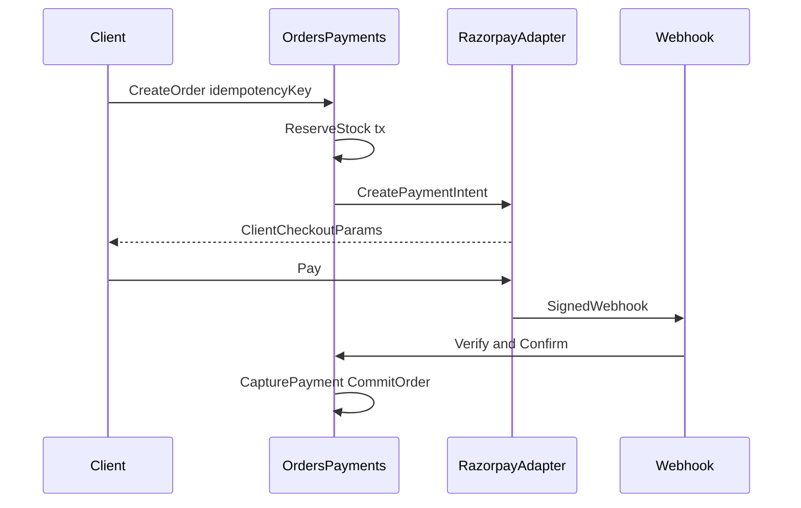

# Payments Architecture — t360

## Principles

- Never store raw card details.
- Never trust client-only payment success.
- Verify Razorpay signatures server-side.
- Make create-order, capture, refund, and webhook handling **idempotent**.
- Business logic depends on `PaymentProvider` port — not Razorpay types.

## Port

```ts
// Conceptual interface — implemented in Phase 7
interface PaymentProvider {
  createOrder(input: CreatePaymentOrderInput): Promise<ProviderOrder>
  verifyWebhook(headers: Record<string, string>, rawBody: Buffer): ProviderEvent
  refund(input: RefundInput): Promise<ProviderRefund>
}
```

Adapters: `RazorpayPaymentProvider` (initial), future providers behind same port.

## Sequence



## Methods

- UPI, cards, net banking, and other Razorpay-supported methods via checkout
- COD when `SystemSetting` / branch config enables it

## Failure modes

| Case | Handling |
|------|----------|
| Duplicate webhook | `WebhookEvent` unique provider id → no-op success |
| Paid but reserve expired | Explicit reconciliation job; do not silently oversell |
| Refund retry | Idempotency key on refund |
| Client abandon | Reservation TTL release job |

## Testing

- Integration tests with Razorpay test keys / signed fixture payloads
- No “fake success” path in production builds
- Dev-only mock provider clearly labeled `PAYMENT_PROVIDER=mock`
